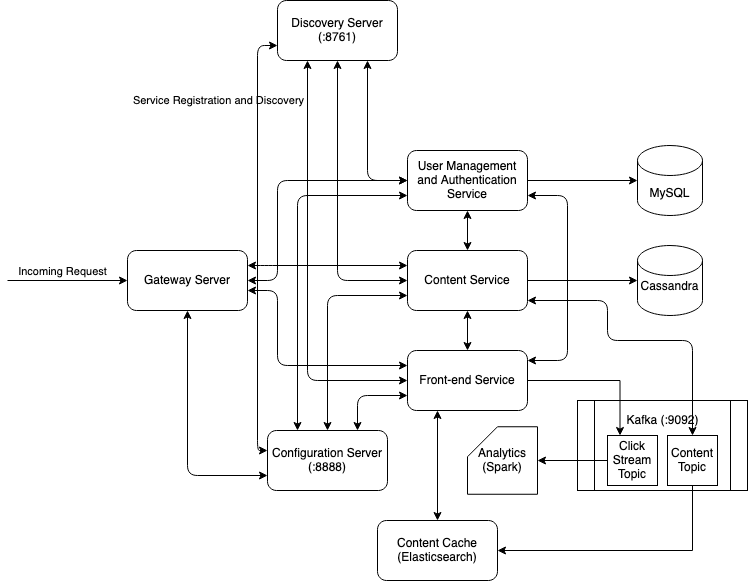

# How to build an Exchange

An implementation of an exchange based on the following:
- https://www.youtube.com/watch?v=b1e4t2k2KJY
- https://www.youtube.com/watch?v=dUMWMZmMsVE

## Data Structures Used

### 1. Limit Order Book (A NASDAQ Workstation Style Book)

- **Buys / Bids**: Best prices to buy, sorted in decreasing order
- **Sales / Offers**: Best prices to sell, sorted in increasing order

**Other entities:** Market Participants, Instruments

## Design Decisions

- Do we want to parallelize at the level of an instrument? i.e. maintain an orderbook datastructure for each instrument. Ocassionaly, we may want to touch two diffent instruments

## Non-Functional Requirements

1. Scale, (3M messages/s, 10k symbols)
2. Fairness
3. Reliability
4. Durability

## Microservices

1. Matching Engine
2. Canceller
3. Trade Reporter
4. Market Data (filtered versions of the raw transactions)

## Cassandra Data Modeling

```sql
CREATE KEYSPACE fictitiousstockexchange
WITH REPLICATION = {
    'class': 'SimpleStrategy',
    'replication_factor':  1
};

USE fictitiousstockexchange;

CREATE TABLE bids (
    bid_time_uuid TIMEUUID,
    initiater_id TEXT,
    ticker_symbol TEXT,
    number_of_shares DOUBLE,
    bid_price DOUBLE,
    country TEXT,
    PRIMARY KEY ((country, ticker_symbol), initiater_id, bid_time_uuid)
);

CREATE TABLE asks (
    ask_time_uuid TIMEUUID,
    initiater_id TEXT,
    ticker_symbol TEXT,
    number_of_shares DOUBLE,
    ask_price DOUBLE,
    country TEXT,
    PRIMARY KEY ((country, ticker_symbol), initiater_id, ask_time_uuid)
);

CREATE TABLE transfers (
    transfer_time_uuid TIMEUUID,
    initiater_id TEXT,
    ticker_symbol TEXT,
    number_of_shares DOUBLE,
    credit BOOLEAN,
    share_price DOUBLE,
    country TEXT,
    PRIMARY KEY ((country, ticker_symbol), initiater_id, transfer_time_uuid)
);
```

## Architecture



*Note: The architecture has chnaged since I made this picture. Will change it once I have a stable version*

## Prerequites

1. Apache Kafka

```sh
~ ./$KAFKA_BIN/bin/zookeeper-server-start.sh ./$KAFKA_BIN/config/zookeeper.properties
~ ./$KAFKA_BIN/bin/kafka-server-start.sh ./$KAFKA_BIN/config/server.properties
```

2. Compile all sub-projects

```sh
~ mvn clean compile
```

This should also build Docker containers for all the services

3. Start all the services

```sh
~ docker-compose up -d
```

## API

Create new bids

```sh
curl -X POST -H "Content-Type: application/json" -d '{"country": "US", "tickerSymbol": "AAPL", "initiaterId": "AAPL", "numberOfShares": 1000, "bidPrice": 40}' localhost:8002/bids
```
